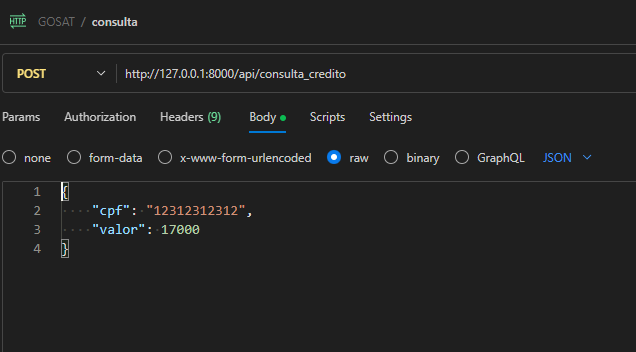

# API CRÉDITO

Projeto integrante do processo de seleção a vaga de desenvolvedor PHP na GOSAT 2025.

## Versões
- PHP 8.4

- Laravel 12

## Execução do projeto

#### Execute os comandos para baixar os pacotes.

    composer install
    npm i

* Para facilitar a execução, foi forçado o commit dos arquivos .env, database.sqlite e do build dos arquivos vue.

#### Banco de dados

O projeto usa o sqlite para simplificar o uso, para isto basta que exista o arquivo

    database/database.sqlite

As tabelas serão criadas executando o comando:

    php artisan migrate

Para que a aplicação inicie deve-se executar os comandos:

    php artisan serve

## Consulta API

A função pode ser chamada por POST ao endpoint /api/consulta_credito passando os valores:

- cpf

- valor (valor que deseja obter)

## Tela de Consulta

Afim de consumir a API a tela de consulta realiza chamada ajax ao endpoint e retorna os dados em tela.